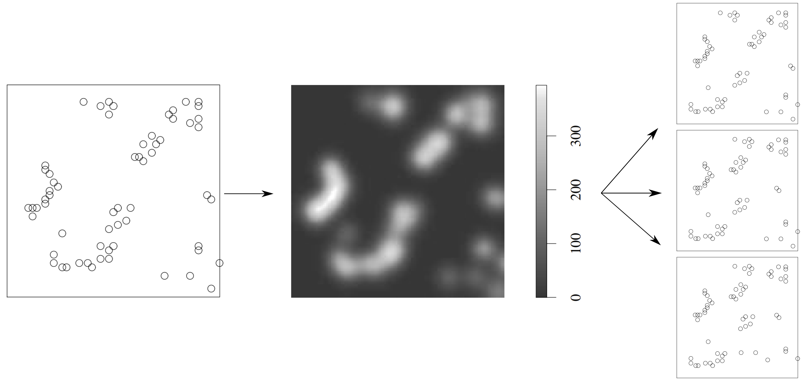
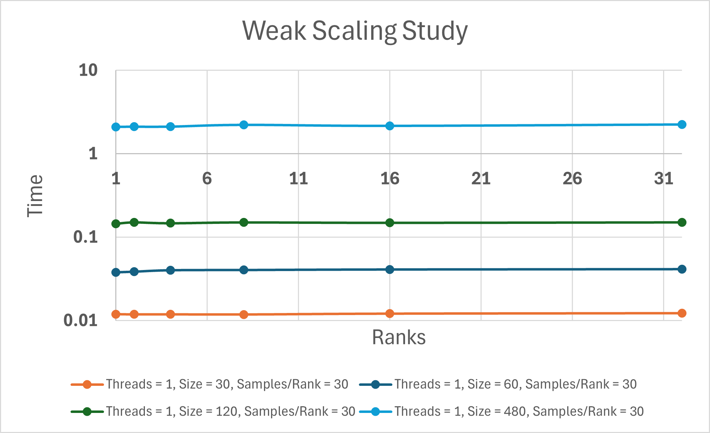

# Title: Modelling of Point Pattern as a Point Process Realization and Sampling of Further Realizations

# Introduction

## Motivation
Spatial point patterns refer to the arrangement of individual points within a geographic area, often studied in fields such as ecology [1], criminology [2], and bifurcation detection [3]. These patterns are essential for understanding the distribution of events or phenomena across space using point data. For example, in ecology, spatial point patterns might represent the locations of plant species within a forest. Analyzing spatial point patterns helps identify trends, clusters, and underlying processes driving these spatial distributions. By understanding these patterns, informed decisions can be made in various applications. 

In the study of spatial point patterns, the distribution of points in the space matters. Are points evenly distributed in the $R^2$ space? Is point density related to any factors? Are the points randomly scattered or clustered in areas? These questions are focused on how the points were generated, and not the points themselves, which led to the study of modelling given point patterns as spatial point processes. This involves finding a likelihood on the space based on the given point pattern which is presumably the expectation of the process generating the pattern. 

These methods of spatial point modelling can also be used for the sampling of more patterns / realizations. This can be used as an alternative to methods like subsampling in the case of insufficient data to generate statistical results. For example, spatial point process modelling has been used to generate further persistence diagrams (from topological data analysis) to compensate for insufficient or unreliable data [3-5]. 

## Mathematical Background

### Spatial Point Process Modelling

Spatial point process modelling is based on the following ideas

1. Assumeption that a stochastic process $X$ with expectation $p$ exists.
2. A given point pattern $\chi$ is a realization of $X$.
3. $\chi$ can be used to estimate $p$.
4. Once $p$ is estimated, new patterns $\chi_i$ can be sampled using monte carlo methods.

Figure 1 shows the main idea.



*Fig. 1: Schematic of the process: generate an expectation from a given point pattern and then sample new patterns. Figure replicated from [6] with minor edits.*

This expectation or probability can be computed in many ways. The basic idea is to define a rule for interaction between the various points in the given point pattern. Typically, this interaction is composed of a global and local term. In general,

The local term can be composed of distances between points, number of nearest neighbours, fixed radii brackets, etc. While the global term can be made up of the kernel density of points, tesselations like voronoi or delauney, fixed number of points per area, etc.

For example, the local and global terms of a Pairwise Interaction Point Process model are shown below in Figure 2.


*Fig. 2: Schematic of the local and global terms used in a Pairwise Interaction Point Process. The local term is composed of number of points within various radii brackets, while the global term is proportional to the areas of voronoi tessalations. Figure replicated from [3] with minor edits.*

### Strauss Model

The Strauss process is a common spatial point process, providing an easy framework for modeling the spatial distribution of points in a point pattern. Let $\chi$ represent a spatial domain of interest, typically embedded in an Euclidean space of $\mathbb{R}^d$, where $d$ denotes the dimension of the space and will be equal to $2$ for us. Each point in $\chi$ is characterized by its spatial coordinates $\textbf{x}$. 

A Strauss process is defined by the following parameters:
1. $\lambda$: an intensity of points per unit area
2. $r$: a radius such other points are less likely to exist inside this radius of another point
3. $\beta$: a repulsion factor inside the radius $r$

In such a Strauss process, the probability (or density), denoted as $p$, governs the likelihood of a point at any location. This probability, at each point in space, is tied to both parameters discussed above through the following rule: 

$p(\textbf{x}) = \lambda * \exp{(-\beta * n)}$, where $n$ represents the number of points present in the radius $r$ of $\textbf{x}$. For our simplicity, we will be setting $\beta = 1$ for all simulations.

This formula for $p$ characterizes both the interplay between the global intensity of point occurrences and the local clustering tendencies within the spatial domain. It highlights the tendency for points to repel as they approach each other, thereby influencing the likelihood of additional points being accepted into the pattern.

### Modelling as a Spatial Process and Generating More Samples

Taking a random point pattern and generating more samples of it is a two-step process. The method is defined briefly here, see [6] for details.

1. Given a point pattern $\chi$, finding the likelihood $p$ of the underlying spatial point process given a certain rule on the interaction of points with each other.
2. Using Monte Carlo methods to generate more samples.

## Project Goals

The goals of this project are to develop an efficient code, parallelized with two different strategies using OpenMP and MP, for sampling _numPatterns_ number of patterns given an initial point pattern of _numPoints_ size. This efficiency or increased performance will be studied using weak scaling, strong scaling and a thread-to-thread speed-up study. The weak scaling study would monitor the time for convergence as _numPatterns_ per MPI rank are kept constant. The strong scaling study will monitor the time for convergence as more MPI ranks are used for the same problem size. Finally, the thread-to-thread speed-up study will monitor the efficiency of increasing the number of threads with the same problem size. 

# Methods

In this work, we will be modelling point patterns as Strauss models (described above) and then using a simplified Metropolis-Hastings approach for generating new samples. The two steps described in the last section are explained in more detail below:

### Step 1: Modelling as a Strauss Process by Computing Strauss Parameters

Given an initial point pattern of $N$ points $\chi = \{x_1, x_2, \cdots, x_N\} \in \mathbb{R}^2$, where each $x_i$ is a point with coordinates $x_i = (x_i^{(0)}, x_i^{(1)})$ for $i = 1, 2, \cdots, N$, the average nearest neighbor distance $d_{\text{avg}}$ can be calculated as follows:

$d_{\text{avg}} = \sum_{i=1}^{N} \min_{j=1, j \neq i}^{N} \left( \sqrt{(x_i^{(0)} - x_j^{(0)})^2 + (x_i^{(1)} - x_j^{(1)})^2} \right) / N$ 

Once we have the average nearest neighbour distance, the radius $r$ can be chosen as any value less than this. For our computations:
$r = d_{\text{avg}} / 2$

And then, once we have the radius, the intensity $\lambda$ can be calculated as:
$\lambda = 1 / (\pi * r^2)$
 
### Step 2: Metropolis-Hastings Sampling
The Metropolis-Hastings is a Markov chain Monte Carlo (MCMC) algorithm used for generating samples from a distribution. It has the following general steps:

1. **Initialize**: Start with an initial state, often chosen randomly or based on some prior knowledge. For us, this would be the initial given point pattern $\chi$.
2. **Proposal a New State**: Propose a new state. For us, this would be proposing a new point in lieu of each of the points in the current point pattern. This new point is generally inverse sampled from the model generated in Step 1. However, for our ease, we will be uniformly sampling a point within a randomized distance of the current point.
3. **Acceptance Probability**: Calculate the acceptance probability for the proposed state. This is calculated using the probability $p$ defined earlier.
4. **Accept or Reject**: Accept the proposed state with a probability determined by the acceptance probability. If the acceptance probability is greater than $D \sim \mathcal{U}(0,1)$, replace the current state (point pattern) with this new point pattern.
5. **Repeat**: Repeat steps 2-4 for some iterations called a burn-in period to stabilize the model.

## Example from Code

See the serial code as ```serial.cpp```. This is compiled with ```g++ -o serial serial.cpp``` and executed as ```./serial {numPoints} {numPatterns}```.

There are two major loops in the code.

1. Loop for computing _numPatterns_ number of realizations. 
2. Loop for iterating through each of the _numPoints_ points in the point patterns during burn-in for proposing replacement points.

Given a randomly generated point pattern of 10 points in Figure 3, a Strauss expectation was computed as shown in Figure 4. From this expectation, many new point patterns were sampled, each with a burn-in of $10$. 4 such samples are shown in Figure 5.


*Fig. 3: The original point pattern taken for the Strauss modelling.*


*Fig. 4: The expectation generation from the original pattern. Notice the low probability of points occurring in a radius r of the original points.*


*Fig. 5: Sampled realizations from the expectation with a burn-in of 10 each.*

## Parallelization

See the parallelized code as ```parallel.cpp```. This is compiled with ```mpicxx -fopenmp -o parallel parallel.cpp``` and executed as ```mpirun -np {mpi_ranks} ./parallel {numPoints} {numPatterns} {omp_threads}```.

The serial code's two loops were parallelized using OpenMP and MPI.

The parallelization strategy for the serial code involves a combination of task-based and domain-based (although not exactly domain-decomposition) approaches, along with leveraging shared memory capabilities offered by OpenMP. The task-based approach uses MPI to parallelize the first loop (over _numPatterns_) responsible for generating realizations. This approach divides the workload among multiple MPI ranks, where each rank handles a subset of the total number of patterns to be generated. Distributing the task of generating patterns across ranks, allows for simultaneous generation of multiple realizations.

On the other hand, the domain-based approach is used for parallelizing the inner loop (over _numPoints_), which iterates through each point in the current state or pattern during burn-in. Here, OpenMP is used to distribute the workload across multiple threads. Each thread operates on a subset of points within the pattern, with shared access to the same variable representing the current point pattern. 

# Verification / Validation Test

The verification for whether a sampled point pattern conforms to the underlying Strauss process is done by using the same expression provided for acceptance probability. 

$p(\textbf{x}) = \lambda * \exp{(-n)}$, where $n$ represents the number of points present in the radius $r$ of $\textbf{x}$. 

Except, for verification, the acceptance probability is set to a higher standard and has to be greater than $0.5$ instead of just being greater than a uniformly sampled random number. In the provided code, we iterate through each sampled point and calculate the acceptance probability for verification. If the acceptance probability for any point falls below a threshold of $0.5$, it suggests that the sampled point pattern deviates from the expected Strauss process.

For validation of the parallelized code, the same function is used to verify whether each point pattern sampled belongs to the underlying Strauss process or not. This would not report whether the results are exactly the same as the serialized version since the overall process is highly randomized, but it would verify that the code functions as it should and generates point patterns which are Strauss.

# Load Balancing and Memory Usage

Load balancing refers to distributing the computational workload evenly among MPI ranks to maximize resource utilization. In the parallelized code, the following formula 

```count = numPatterns / numtasks + ((numPatterns % numtasks) > rank)```

is used to determine the number of patterns each MPI rank should handle. Here, _numPatterns_ represents the total number of patterns required, _numtasks_ represents the total number of MPI ranks, and _rank_ represents the rank of the current MPI process.

This formula divides the total number of patterns (_numPatterns_) by the number of MPI ranks (_numtasks_) using integer division, which ensures that each rank handles an approximately equal number of patterns. The remainder of the division (_numPatterns_ % _numtasks_) is then checked against the current rank. If the rank exceeds the remainder, it gets one additional pattern to balance the workload. 

In the parallelization strategy discussed, memory usage is optimized by minimizing unnecessary data storage and maximizing data locality within each MPI rank and OpenMP thread. Within each MPI rank, the parallelization strategy employs a domain-based approach using OpenMP to distribute the workload among multiple threads. Each thread operates on a subset of points within the pattern, with shared access to the same variable representing the current point pattern. This approach minimizes memory overhead by avoiding redundant storage of pattern data for each thread and maximizes data locality by ensuring that threads operate on only the necessary subset of the point pattern. Although trivial, but memory usage is also minimized by using MPI_REDUCE to find the max elapsed time instead of storing each separately.

# Scaling Studies

Three scaling studies were performed for this project: strong scaling, weak scaling and thread-to-thread speed up. The results can be seen in ```results.xlsx``` and ```weak_study.xlsx```. Figures generated for each are given in this section.

## Strong Scaling
The strong scaling study was conducted by fixing number of threads, _numPatterns_ and _numPoints_, and varying the number of MPI ranks. The ideal result in each case is linear reduction in time consumed as ranks are increased. An efficiency can be calculated for each of these using $E = T_1 / (P * T_P)$ where $T_1$ is the time for 1 rank and $T_P$ is the time for $P$ ranks. However, only the ideal lines are being plotted as dashed lines over each curve. _Samples_ refers to _numPatterns_ and _Size_ refers to _numPoints_ in Figure 6 which shows strong scaling.


*Fig. 6: The plots for the strong scaling study for MPI ranks.*

Figure 6 shows that in general, the scaling is close to ideal for a high number of _Samples_ and _Sizes_, indicating a perfect parallelization. However, at low number of _Samples_ and _Sizes_, the performance isn't ideal, indicating efficiency loss due to communication overhead.

## Weak Scaling
The weak scaling study was conducted by fixing number of threads, _numPoints_ and the number of _numPatterns_ per rank, while varying the total ranks with total _numPatterns_. The ideal result in each case is a constant line such that the time consumption does not vary significantly.  _Samples_ refers to _numPatterns_ and _Size_ refers to _numPoints_ in Figure 7 which shows the weak scaling study plots.



*Fig. 7: The plots for the weak scaling study for MPI ranks.*

Figure 7 shows an almost ideal behaviour---with the time convergence being undisturbed by changing anything as long as the processes per rank remain constant. Minor fluctuations owe themselves to random CPU processes and networking losses.

## Thread-to-Thread Speed Up
The thread-to-thread speed up study was conducted by fixing number of MPI ranks, _numPatterns_ and _numPoints_, while varying the number of threads used by OpenMP. The ideal result in each case is linear reduction in time consumed as threads are increased. An efficiency can be calculated for each of these using $E = T_1 / (P * T_P)$ where $T_1$ is the time for 1 thread and $T_P$ is the time for $P$ threads. However, only the ideal lines are being plotted as dashed lines over each curve. _Samples_ refers to _numPatterns_ and _Size_ refers to _numPoints_ in Figure 8 which shows the thread-to-thread speed up study.


*Fig. 8: The plots for thread-to-thread speed-up study for OpenMP threads.*

Figure 8 shows that for high _Samples_ and _Size_, the parallelization is nearly ideal, while the efficiency somewhat drops at low number of _Samples_ and _Size_. In general, the results show a high efficiency of parallelization.

The purple and light green lines in Figure 8 are plotted to highlight the limitations of this parallelization. The purple line corresponds to a very small _Size_ (OpenMP parallelizes the _Size_ loop) which shows an almost constant time required since many ranks would be underused as the problem size is very small. This leads to poor efficiency since the communication overhead of introducing more threads does not pay off given the number of iterations required are small. On the other hand, the light green curve shows the use of 4 ranks against each number of threads specified---here, we see a massive spike in time after 16 threads instead of the expected decrease. This owes to the fact that the PC being used has a maximum of 64 cores with only 1 thread per each core. Which means that even though we requested 32 threads with 4 ranks, we only got 16 since the PC cannot physically allot us any more threads---leading to the time to converge increasing itself.

# Conclusion

In this study, we explored the efficacy of spatial point process modelling for sampling new point patterns given an original point pattern in $\mathbb{R}^2$ using task-based and domain-based parallelizations, through MPI and OpenMP respectively. Our performance studies encompassed weak and strong scaling for MPI ranks, along with a thread-to-thread speedup for OpenMP.

The implementation demonstrated efficient parallelization through the combined use of OpenMP and MPI. We achieved significant performance improvements, enabling the generation of large-scale point patterns with reduced computational time. The weak and strong scaling studies demonstrated that our parallelization approach showed a close to ideal behavior---indicating that the implementation scales well with increasing problem sizes. The thread-to-thread speedup also demonstrated high efficiency with limitations due to computer specifications and communication overhead at small problem sizes.

While the study demonstrates promising results, further optimization efforts could focus on improving parallelization strategies. One possible direction is to include a third parallelization over the _burn-in_ loop, which should significantly reduce the time for convergence as in some cases, the _burn-in_ can be over iterations as many as 1000. This is left to be explored in future work.

# References

1. Velázquez, E., Martínez, I., Getzin, S., Moloney, K. A., & Wiegand, T. (2016). An evaluation of the state of spatial point pattern analysis in ecology. Ecography, 39(11), 1042–1055. https://doi.org/10.1111/ecog.01579

2. Park, J., Schoenberg, F. P., Bertozzi, A. L., & Brantingham, P. J. (2021). Investigating clustering and violence interruption in gang-related violent crime data using spatial–temporal point processes with covariates. Journal of the American Statistical Association, 116(536), 1674–1687. https://doi.org/10.1080/01621459.2021.1898408

3. Tanweer, S., & Khasawneh, F. A. (2024). Topological detection of phenomenological bifurcations with unreliable kernel densities. https://doi.org/10.48550/ARXIV.2401.16563

4. Adler, R. J., & Agami, S. (2019). Modelling persistence diagrams with planar point processes, and revealing topology with bagplots. Journal of Applied and Computational Topology, 3(3), 139–183. https://doi.org/10.1007/s41468-019-00035-w

5. Papamarkou, T., Nasrin, F., Lawson, A., Gong, N., Rios, O., & Maroulas, V. (2022). A random persistence diagram generator. Statistics and Computing, 32(5). https://doi.org/10.1007/s11222-022-10141-y

6. Spatial Point Patterns Methodology and Applications with R. Baddeley A., Rubak E., Turner R. CRC Press (2016).

7. Help from ChatGPT for better writing and paraphrasing stuff.
