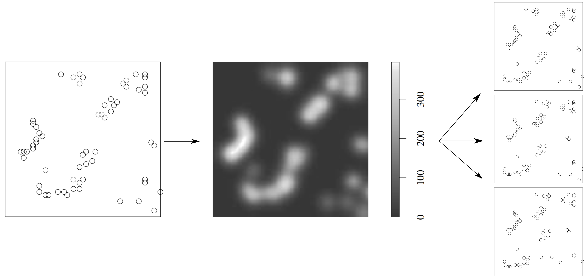

# Parallel_Computed_Strauss_PointPattern_Generation
The repository holds the OpenMP and MPI hybrid parallelized code for Strauss modelling of point patterns, used for the final project of CMSE-822 Parallel Computing class at MSU in Spring 2024.

[Proposal.md](Proposal.md) describes the initial proposal for this project.

[Final_Project_Report.md](Final_Project_Report.md) gives the report for this project.

[parallel.cpp](parallel.cpp) shows the code for the parallelized version while [serial.cpp](serial.cpp) gives the serial code. The file [plotting.py](plotting.py) can be used for generating plots of original point cloud, the expectation and the sampled point patterns.

Files [results.xlsx](results.xlsx) and [weak_study.xlsx](weak_study.xlsx) give all the data generated by multiple runs and the subset of that data used to generate the weak scaling, strong scaling and thread-to-thread speed up plots.

